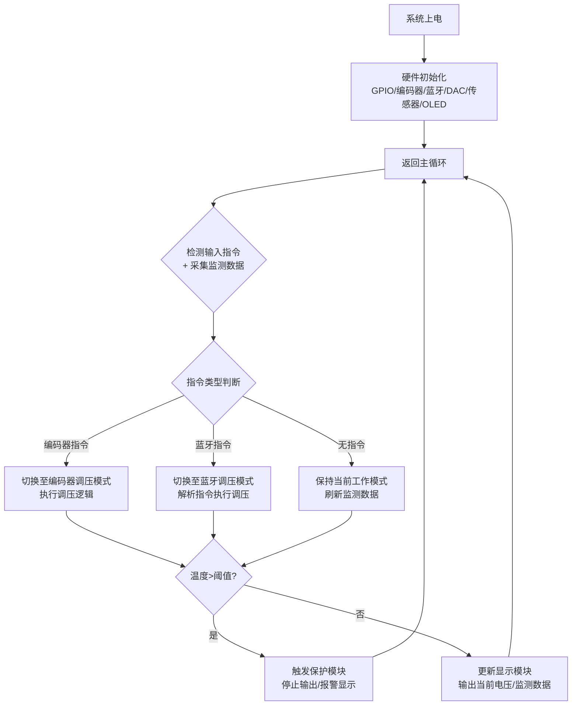
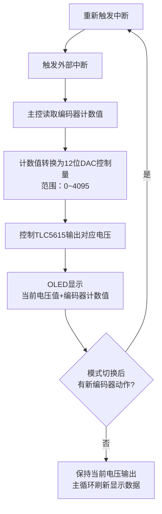
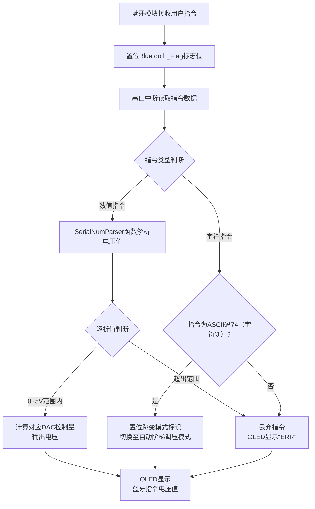
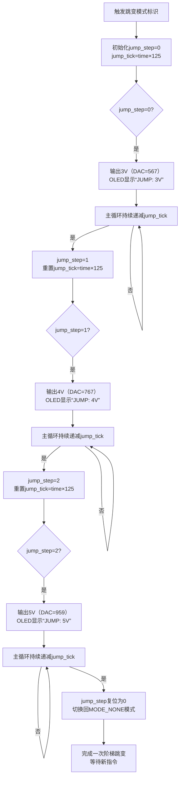
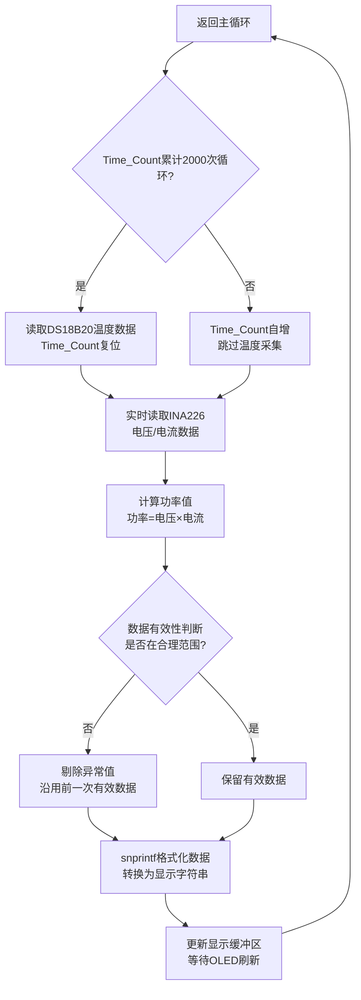

# 1. 绪论
## 1.1 研究背景及意义
直流电源作为电子设备、精密仪器及工业系统的核心能量供给单元，其输出稳定性、精度与安全性直接决定下游设备的运行质量。随着精密制造、新能源、5G通信等领域的快速发展，传统固定输出型直流稳压电源已难以适配多样化应用需求——科研测试场景需灵活调整电压电流参数，工业生产环节要求电源具备远程控制与数据反馈能力，而精密仪器供电则对电源纹波、输出精度提出严苛标准。在此背景下，可编程直流稳压电源凭借数字化控制、参数灵活配置、实时监控反馈等核心特性，成为电源领域的研究与应用热点，亦是衡量国家电力电子技术水平的重要指标。
从技术需求来看，现代应用场景对可编程直流稳压电源提出三大核心诉求：其一，高精度与高稳定性，要求电源在负载波动、外部干扰工况下，输出纹波低于毫伏级，电压稳定度达0.01%以上，以适配芯片测试、计量校准等精密场景；其二，灵活的可编程与通信能力，需支持上位机指令控制及恒压、恒流或恒功率多模式输出，满足自动化产线集成需求；其三，全面的安全防护，需具备过压、过流、短路及过温保护功能，避免电源设备与下游负载损坏。
## 1.2 国内外研究现状
当前国内中低端可编程电源普遍存在精度不足、动态响应迟缓、通信兼容性差等问题。国内中小厂商的中低端电源输出精度仅±0.1%，低负载漂移超5mV，且多采用私有协议，需定制模块对接PLC，同时中低功率机型外壳温升超35°C，纹波随温度升高呈递增趋势。总体而言，国内产品在核心拓扑设计、控制算法优化等关键技术领域仍存在较大提升空间。
从行业发展趋势来看，可编程直流稳压电源正朝着微型化、智能化、网络化方向演进。目前海外品牌已推出集成AI算法的自适应电源，可根据负载特性自动优化输出参数；而国内产品在智能化算法研发、多机组网控制等方面仍处于起步阶段。
## 1.3 研究内容
本项目设计既能够补齐国内中低端产品的性能短板，又为后续集成物联网、AI控制功能预留了硬件接口，契合行业技术升级的整体方向。结合可编程直流稳压电源的技术现状及课程项目要求，本项目重点针对以下核心模块开展技术突破：
1. 主稳压电路模块：采用开关源+线性源混合架构，替代传统单一拓扑方案。传统开关源效率高但输出纹波大，线性源纹波低但效率不足，二者难以同时满足精密场景“高效+低纹波”的双重需求。本设计中，开关源模块构成DC-DC变换电路以保障电源转换效率，线性源模块通过运算放大器构建稳压电路，可将输出纹波控制在5mV以内，实现效率与纹波性能的兼顾。
2. 外设电路模块：集成过热、过流、过压、防雷及EMI滤波等电路，适配复杂工作环境，兼顾电源效率与运行安全。其中，过流保护电路通过取样电阻采集电流信号，配合比较器触发保护机制并驱动LED提示，解决负载过载时“无预警、易烧机”的问题；过压保护电路利用稳压管钳位电压、三极管触发输出切断，避免电压突增损坏传感器、芯片等精密负载；防雷+EMI滤波电路集成保险丝、压敏电阻、共模电感等元件，既能够抑制工业环境中的电磁干扰（EMI），又可防护户外测试场景的雷击浪涌，保障复杂工况下的稳定供电。
3. 硬件控制与交互模块：构建“数字控制+可视化交互”架构，解决传统电源“操作繁琐、数据无分析”的痛点。实现网页端输出目标电压、电流的简易运算，完成手机Web端编译部署（当前阶段基于蓝牙模块自带网页实现单片机输出电压、电流的调控），可实现输出电压简易数学运算及误差分析；通过Keil uVision 5软件控制STM32单片机，实现3V→4V→5V阶梯式可编程调压（每级平台时间可调，同步采集电压、电流数据），并将实时参数通过液晶屏可视化输出，适配教学实验、小型研发等“分步控电+直观观测”场景。
本项目聚焦实验室教学、小型嵌入式开发及便携式电子调试场景，研发“220V市电输入、0V—16V输出可调、低纹波小功率可编程电源”，重点攻克以下三大核心目标：
1. 多档位可编程调压需求。要求电源可独立完成3V→4V→5V电压跳变，且在各档位电压下稳定停留10s；
2. 低纹波稳定供电需求。电源输出纹波要求<10mV；
3. 便捷化调试交互需求。便携式调试场景需具备“无线控制+手机端显示”功能操作灵活性，无法适配多类型场景需求。
## 1.4 本章小结
随着精密制造、5G通信等领域发展，可编程直流稳压电源成为刚需，但国内中低端产品存在精度不足、纹波过大、交互不便等短板，高端市场被海外品牌主导。本项目立足实验室教学、便携式调试等场景，以研发220V市电输入、0V-16V输出可调的低纹波小功率可编程电源为目标，通过开关源+线性源混合稳压、多维度安全防护、数字控制与可视化交互三大核心模块突破，攻克多档位时序调压、低纹波供电、无线便捷交互三大关键需求，既弥补国内同类产品性能短板，也契合行业微型化、智能化、网络化发展趋势，具备明确的应用价值与技术适配性。
# 2. 硬件系统的设计与制作
## 2.1 过流保护电路
### 2.1.1 功能阐述
该模块的预期作用是当输出电流小于1A时，电路正常工作；输出电流超过1A时，通过反馈给单片机断开电路，以保护元件。
### 2.1.2 电路设计历程
对于过流保护电路，最初的设想是通过一个采样电阻将电流信号转化为电压信号，控制三极管通断以改变MOS管的栅极电压，达到通断电路的目的，如图1.1-1所示。

但在具体实验时，发现电路中MOS管在整个工作状态下始终具有很大的分压（电压12V，电流0.3A条件下，就具有10V左右电压），经分析，发现原因是MOS管处于线性放大区，具有较大的等效电阻。
  
之后对该电路做出改进，如图1.1-2所示，在电流信号转化为电压信号后，进行电压比较，输出高低电平反馈给单片机来通断电路。

$$图1.1-2$$
但具体实验时，发现电压比较器的输出结果不稳定（高低电平交替），经分析，是三极管的存在破坏了电压比较器的拓扑结构，同时其自身的通断状况也会改变其总体的等效电路，进而改变基极与集电极的电压。

最终，受电流传感器的启发，现采用运算放大器的运算性质采集采样电阻两端电压，并与基准电压比较，输出的高低电平反馈给单片机来进行过流保护，如图1.1-3所示。

### 2.1.3 具体电路分析
该模块主要分为电流采样电路、电压比较电路、反馈电路三部分。

其中，电压比较器LM2903P进行电压比较时需要接一个上拉电阻R~6~，且输出端是一个三极管结构，其原理是当同相输入端电压小于反相输入端电压时，三极管导通，输出电压是三极管发射级与集电极两端电压，一般小于0.7V，为低电平；当同相输入端电压大于反相输入端电压时，三极管截止，输出电压近似为VCC-input。
  
该保护电路先利用运放对采样电阻两端电压进行减法运算，将电流信号转化为电压信号，其中输出电压与输入电压之间的关系为
$$ 
Uo =\frac{R~5~}{R~4~+R~5~}*\frac{R~2~+R~3~}{R~3~}*Ui1-\frac{R~2~}{R~3~}*Ui2
$$
实际电路中，将R~2~、R~3~、R~4~、R~5~均设置为1kΩ，则有
$$
Uo=Ui1-Ui2
$$
之后，将U~o~与利用稳压管提供的基准电压进行比较输出，经过限幅电路输出高低电平传给单片机。其中运放的作用是将上拉电阻（一般1到10kΩ）与限幅电路进行隔离，使限流电阻R~8~与稳压管匹配
 
经过实验，该种方案设计的电路能够在电路电流为1.02A时，单片机会断开电路，结果基本符合预期。
## 2.2  过压保护电路
### 2.2.1 功能阐述
该模块的作用是当输出电压大于20V时，断开电路，防止对半导体器件造成不可逆损害。
### 2.2.2 电路设计历程
对于电压保护电路，最初的设想与过流保护电路类似，原理都是利用三极管的通断情况控制MOS管的通断进而控制电路，如图2.1-1所示。

但在具体实验时，遇到与过流保护电路类似的情况，MOS占有很高的电压，会对主稳压回路造成影响，故不采用这一设想。

最终确定的方案依旧是进行电压比较，反馈给单片机，其间用到了稳压管的稳压特性。

### 2.2.3 具体电路分析
过压保护电路如图2.2-1所示。

$$图2.2-1$$
该电路并联在稳压电压输出的两端，其中
$$
R4=R1,R5>R2(略大于）
$$
正常情况下，电压比较器反向输入端电压低于同相输入端，输出低电平；当稳压电源输出电压达到阈值时，R~5~两端电压（即反向输入端电压）稳定至稳压管两端电压，此时同向输入端大于反向输入端，输出高电平，经限幅电路反馈给单片机，断开电路。其中运放作用与过流保护电路中的运放作用相同。

经实验，当输出电压输出20.8V左右电压时，过压保护电路输出高电平，单片机会断开电路，基本符合预期。

## 2.3 过热保护电路
### 2.3.1 功能概述
该模块的作用是当稳压电源内部温度超过75摄氏度时，启动过热保护，断开电路；当温度恢复至55摄氏度以下，开启电路，实现过热保护软开关设计。
### 2.3.2 具体电路分析
为达到预期目标，该模块的主体采用滞回比较器的电路结构，如图3.1-1所示。


$$图3.1-1$$
其中U~2~是一个负温度系数的热敏电阻，温度较低时，电压比较器输出低电平；温度较高时，电压比较器输出高电平。其中高温时，上拉电阻还起到迟滞作用，提高比较器的门限电压，使电路只有在温度降低至一定值时，才会开启。

经过实验，当稳压电源内部温度超过80摄氏度时，启动过热保护，断开电路；当温度恢复至62摄氏度左右，开启电路，基本到达预期。

# 3. 软件系统的设计与制作
## 3.1 器件选型
1. 单片机：
本项目选用LQFP48封装的STM32F103C8T6型单片机。该单片机具备37个GPIO通用输入输出口，并集成USART、SPI、IIC等通信接口及ADC模拟信号采集模块等丰富外设，可充分满足项目中蓝牙通信、OLED显示屏驱动及旋钮编码器信号采集等核心模块的使用需求。此外，该型号单片机成本低廉、性价比突出，相关技术资料详实、社区支持完善，且拥有丰富开源项目资源可供参考，适配新手开发，能够有效降低研发难度、缩短项目周期。
2. OLED显示屏：
OLED显示屏选用中景园电子生产的BCL2864-0.96型OLED显示屏。其分辨率为128×64，采用SPI通信协议，在每个字符占据64个像素点的情况下最多能够显示128个字符，能够满足本项目设定电压、输出电压、输出电流、输出功率以及温度等数据的显示需求，且支持寄生电源模式，无需额外供电。

$$OLED显示屏电路图$$
3. INA226电压、电流及功率检测模块：
输出检测模块采用INA226模块串联接入输出端与负载之间，实时检测可编程电源的电源的输出电压、输出电流和输出功率，通过IIC通信协议实时发送给STM32单片机，并打印到OLED屏幕，且支持寄生电源模式，无需额外供电，。该模块的测量性能可通过采样电阻灵活配置：选用0.1Ω采样电阻时，可实现1000mA量程、0.1mA精度的电流测量；选用0.01Ω采样电阻时，可实现10.00A量程、0.01A精度的电流测量，能够适配本项目设定应用场景下的持续输出检测需求。

$$INA226电压、电流、功率检测模块电路图$$
4. 旋转编码器：
本项目采用增量式旋转编码器，通过测量旋钮的转动情况计算，将旋钮的转动角度转化为高低电平，传送给单片机，进而转化为数字量并根据旋转方向进行相应的加减运算，最终以数字信号的方式输出给TLC5615转化为模拟量，实现对电源输出电压的手动精准调节，有效提升了系统的人机交互性能。

$$旋转编码器电路图$$
5. HC-06蓝牙：
HC-06是一款经典的串口蓝牙透传模块，基于蓝牙2.0+EDR协议，传输距离可达10米，且支持寄生电源模式，无需额外供电，。其采用UART接口与STM32等单片机无缝对接，同时具备低功耗、体积小巧、即插即用的特点，能够满足本项目手机对可编程电源的控制与交互。用户可以在手机端通过蓝牙对输出电压进行设置，同时通过蓝牙得到输出的实时反馈。
6. DS18B20测温模块：
温度采集单元选用DS18B20数字温度传感器模块，该模块采用IIC单总线通信协议，可直接输出数字温度信号，无需额外模数转换电路，能与STM32单片机高效对接。模块测量范围覆盖-55℃—+125℃，在-10℃—+85℃范围内测量精度可达±0.5℃，且支持寄生电源模式，无需额外供电，具备体积小、功耗低、抗干扰能力强的特点。在本项目中，该模块可实时采集电源系统工作环境温度及核心器件温度数据，通过单总线将温度信息传输至STM32单片机，经处理后在OLED显示屏同步显示，为电源系统的温度监控与安全保护提供可靠数据支撑。

$$DS18B20测温模块电路图$$
7. TLC5615数模转换器：
数模转换单元选用TLC5615芯片，该芯片采用SPI串行通信协议，可与STM32单片机高效对接，转换精度高且响应速度快，支持单电源供电，电路设计简洁，无需复杂外围元件。在本项目中，该芯片接收STM32单片机传输的来自蓝牙或者旋转编码器的数字调节信号，将其精准转换为对应的模拟电压信号，进而控制可编程电源的输出电压，是实现电压手动调节功能的核心数模转换部件，保障了电压调节的稳定性与精准度。
8. 基准电压模块初始化：选用LM4040BINZ-2.5/NOPB芯片，提供2.50V高精度基准电压，为后续电压采集与转换环节奠定稳定参考基础。
9. 参考电压放大模块初始化：采用UA741集成运算放大器，搭配1%高精度电阻构成4倍同相比例放大电路，可将0-5.00V参考电压放大至0-20.00V，能够覆盖项目实际0-16.00V输出范围，为稳压回路提供精准可靠的参考电压支撑。
##  3.2 单片机工作逻辑
### 3.2.1 单片机总体工作流程
 基于STM32的多模式电压调节与电参数监测系统设计 系统硬件核心为STM32F10x单片机，外围扩展TLC5615 12位数模转换芯片（DA）、INA226高精度电流电压监测芯片、DS18B20数字温度传感器、旋转编码器、HC-06蓝牙模块、OLED显示屏及LM4040IN2.5基准电压模块。软件层面采用状态机设计思想，将系统运行模式划分为初始模式、编码器调节模式、蓝牙控制模式、电压跳变模式，通过标志位触发模式切换，同时在主循环中完成温度、电参数的实时采集与显示，以及超温、过载保护逻辑的执行。系统整体工作流程如下图所示。

 $$单片机程序流程图$$
### 3.2.2 多模式控制逻辑设计 
系统设计三种调压模式，分别适配手动调节、远程控制及自动阶梯调压场景，各模式独立设计且支持蓝牙输入与旋转编码器输入之间的无缝切换，核心逻辑如下： 
#### 3.2.2.1 编码器调压模式：
编码器调压模式为本地手动调压模式，通过外部中断触发调压逻辑，响应速度快、调节精度高，具体流程如下： 

$$旋转编码器工作流程图$$
当用户旋转编码器时，编码器的相位差信号触发主控芯片的外部中断，中断服务函数中优先读取编码器累计计数值，通过线性映射公式将计数值转换为12位DAC控制量（其中包含10位有效二进制数字），并将控制量写入TLC5615芯片，输出与计数值匹配的模拟电压。同时，OLED显示屏实时刷新当前输出电压值，实现调节过程的可视化反馈。模式切换后，若编码器无新动作，系统将锁定当前DAC控制量，保持电压输出稳定，仅在主循环中持续刷新显示数据，确保显示信息的实时性。 
#### 3.2.2.2 蓝牙调压模式：
蓝牙调压模式为远程控制模式，通过蓝牙模块接收移动端指令，支持自定义电压调节及模式切换，具体流程如下： 

$$蓝牙通信模块工作流程图$$
蓝牙模块接收到用户从移动端发送的指令后，立即置位`Bluetooth_Flag`标志位，触发主控芯片的串口中断；中断服务函数中读取指令数据，并调用`SerialNumParser`解析函数提取指令中的电压数值：若解析出的电压值在0-15V 有效范围内，通过电压-DAC控制量映射公式计算出对应的12位控制量，驱动TLC5615输出该电压，同时OLED屏显示解析出的电压值；若解析出的电压值为74.0V（预设触发指令——“J”对应的ASCII码值），则置位电压跳变模式标识，系统自动切换至下文的自动阶梯调压模式；若解析值超出0~15V范围，则判定为无效指令，直接丢弃并在OLED屏显示“ERR”提示，确保系统运行的稳定性。
#### 3.2.2.3 电压阶梯跳变模式 
该模式由蓝牙特定指令（“J”的ASCAII码74）触发，实现3V→4V→5V的自动阶梯式电压输出，核心通过`jump_step`（跳变步骤）和`jump_tick`（时间计数器）实现时序精准控制，具体流程如下：

$$电压跳变模式工作流程图$$
 模式触发后，首先初始化跳变步骤`jump_step=0`，并根据用户设定的间隔时间`time`计算时间计数器初始值`jump_tick = time×125`（125为系统循环计时系数，确保计数器递减速率与系统主循环周期匹配）。跳变逻辑按步骤依次执行： 
 1. 步骤0：主控输出3V电压（对应DAC控制量567），OLED屏显示“JUMP: 3V”，主循环中持续将`jump_tick`递减，直至其值为0； 
2. 步骤1：`jump_tick`归0后，跳变步骤自增为1，重置`jump_tick`初始值，主控输出4V电压（对应DAC控制量767），OLED屏更新显示“JUMP: 4V”，再次递减`jump_tick`； 
3. 步骤2：`jump_tick`再次归0后，跳变步骤自增为2，重置`jump_tick`初始值，主控输出5V电压（对应DAC控制量959），OLED屏更新显示“JUMP: 5V”，继续递减`jump_tick`； 
4. 完成步骤2后，`jump_tick`归0时将`jump_step`复位为0，系统切换回无模式状态（`MODE_NONE`），结束一次完整的阶梯跳变流程，等待新的指令触发。 
### 3.2.3 数据采集与处理模块 
数据采集与处理模块是系统监测功能的核心，采用“定时采集+实时采集”的混合策略，兼顾采样效率与CPU资源占用，同时通过数据校验确保监测精度，具体流程如下：

 $$数据采集与处理模块工作流程图$$
#### 3.2.3.1 数据采集策略 - 温度采集（DS18B20）
1. 采用定时采集方式，通过`Time_Count`计时变量累计系统主循环次数，每累计2000次循环（对应采样周期2s）触发一次温度读取操作，读取完成后将`Time_Count`复位，避免高频采样占用过多CPU资源；
2. 电参数采集（INA226）：采用实时采集方式，在每次主循环中均读取电压、电流原始数据，并通过公式“功率=电压×电流”实时计算功率值，确保电参数监测的实时性。 
#### 3.2.3.2 数据处理流程 
采集到温度、电压、电流、功率等数据后，首先执行有效性判断：将采集值与预设的合理范围（如温度0-100℃、电压0-15V）对比，若超出范围则判定为异常值，直接剔除并沿用前一次采集的有效数据；若在合理范围内则保留为有效数据。随后调用`snprintf`函数将浮点型的监测数据格式化为固定长度的字符串（如“Temp: 25.5℃”“Volt: 4.20V”），确保OLED显示屏的显示格式统一、清晰易读。格式化后的字符串写入显示缓冲区，等待显示模块在主循环中刷新至OLED屏，完成整个数据采集与处理流程。 
## 3.3系统测试与验证 
### 3.3.1 测试环境 
测试硬件：STM32F103C8T6核心板、TLC5615 DA模块、INA226模块、DS18B20传感器、旋转编码器、HC-06蓝牙模块、0.96寸OLED显示屏；
测试软件：串口调试助手、蓝牙调试APP。 
### 3.3.2 功能验证 
1. 编码器调节模式：旋转编码器，OLED显示电压值随编码器旋转线性变化，实测输出电压与理论计算值误差小于0.02V； 
2. 蓝牙控制模式：通过蓝牙发送0.00~16.00V数值指令，DA输出电压与指令值偏差小于0.1V；发送“J”（对应ASCII码74)可准确切换至电压跳变模式并获取跳变平台时间； 
3. 电压跳变模式：通过蓝牙获取跳变平台时间，测试时设置平台时间为10s，系统按3V→4V→5V循环输出，每个电压维持时间误差小于50ms； 
4. 监测功能：温度采集值与标准温度计对比，误差小于0.2℃；INA226采集电压、电流值与万用表测量值误差小于1%； 
5. 保护功能：温度升至61℃时，系统触发超温保护，DA输出降至低电平，OLED显示告警；认为向单片机相应引脚施加高电平，系统触发过载保护，功能正常。 
### 3.3.3 实际工程中遇到的难题与解决方案
1. 如何实现IIC、SPI、USART以及蓝牙等通信协议实现传感器外设与单片机之间的实时通信：
硬件上，项目选用的STM32F103C8T6单片机一共具有2个IIC通信接口、2个SPI通信接口、3个UASRT串口通信接口以及多组普通GPIO时钟通信接口。实际项目选用了3个IIC通信外设、2个SPI通信外设、1个USART串口通信外设以及一个蓝牙模块，导致IIC通信外设超出单片机硬件能够支持的数量。因此在正常配置两组IIC通信模块的同时需要而外通过软件模拟IIC通信模式，实现单片机与传感器的实时通信。我们利用在GitHub与CSBN等开源平台，获取了模拟IIC通信的开源代码，重新对单片机与外设引脚链接关系使用宏进行重定义，成功实现了3台IIC通信协议驱动的外设以及其他外设与单片机之间的实时通信，系统工作正常。
2. 如何解决多个采用IIC通信的外设同时工作时延时时序逻辑的冲突与混乱：
项目选用的INA226电压电流功率监测模块、DS18B20测温模块与旋转编码器均采用软件模拟IIC通信协议，其中DS18B20采用IIC总线通信，是本项目的遇到的一大难点。一方面，IIC总线通信方式对单片机程序的时序逻辑有着极为严格的要求，任何程序外的中断都有会打乱DS18B20通信总线上的信号传输；另一方面三个外设均采用同一套程序模拟IIC通信协议，且DS18B20的通信频率与其他模块不同，当程序运行时间接近两者通信周期的最小公倍数时，两者通信的高低电平信号会相互重叠，单片机持续接收到高电平或低电平，寄存器数据溢出，无法正常工作。为了解决这一问题，我们通过认为设置采样周期，每两秒暂停其他通信采集一次温度数据的方式成功实现了所有数据的正常采集。DS18B20的采样时长约为100ms，远低于正常人的反应时间，实际使用时不会感受到程序卡壳、停顿等问题。
3. 如何解决控制电路的数字采样与反馈调节的延时问题：
我们通过INA226模块实时采集输出电压并引入负反馈，进一步稳定输出。其一，优化采样配置，降低 INA226 的转换时间与平均次数，在保证采样精度前提下缩短数据采集周期。其二，精简数据传输与处理流程，采用 DMA 方式读取采样数据，减少 CPU 中断响应耗时，同时简化反馈算法的运算逻辑，避免冗余计算。有效减小采样与反馈延时，增强输出电压的稳定性。
## 3.4 本章小结
1. 系统软件采用模块化闭环设计，主循环核心执行“指令检测-模式切换-数据采集-保护判断-显示更新”逻辑，确保各模块协同运行且响应实时； 
2. 多模式调压逻辑通过中断触发（编码器）、指令解析（蓝牙）、时序控制（阶梯跳变）实现不同场景的调压需求，模式切换无缝且逻辑独立； 
3. 数据采集采用“定时+实时”混合策略，结合有效性判断和格式化处理，在控制CPU资源占用的同时保证了监测数据的准确性与显示统一性。
4. 长时间工作后，DAC输出电压存在微小漂移。后续可通过引入PID校准算法，定期根据INA226测量值修正DAC控制量，补偿漂移误差等方式加以改进。
# 4. 结论

# 5. 结束语
本文依托于北京航空航天大学沈元学院《电路与模拟电子技术》课程实训第五组的项目，重点阐述了本小组所制作的可编程直流稳压电源的工作原理、电路的设计与焊接、各模块程序编写、总装测试与成果验收等内容，为高精度、低功耗、小功率新型可编程直流稳压电源的设计与制作提供了一种线性稳压器与开关变换器相互组合的全新方案，为后续的同学完设计、善本项目提供了一种新思路。
除220V交流电转24V直流输出模块工程图外项目所涉及到的电路原理图，PCB工程图，外壳，论文以及STM32单片机代码等资料整理后将在Github平台开源（[hengxufu/Programmable-DC-power-supply: Course Practice Project of Circuits and Analog Electronics](https://github.com/hengxufu/Programmable-DC-power-supply)）。
# 6. 致谢
本论文的顺利完成，离不开各位老师、同学与组员的鼎力支持和无私帮助，在此谨致以最诚挚的谢意！
首先，我衷心感谢《电路与模拟电子技术》课程的授课老师唐瑶教授与实训指导老师徐萍副教授。在项目开展的全过程中，老师以深厚的专业知识和丰富的实践经验，为我们指明了研究方向，在电路拓扑设计、控制逻辑优化、问题排查等关键环节给予了精准的指导，帮助我们攻克了诸多技术难题，让我们不仅掌握了可编程直流稳压电源的核心技术，更深刻理解了理论与实践相结合的重要意义。同时，感谢北京航空航天大学沈元学院为我们提供了优质的实训平台和完善的实验条件，为项目的顺利推进奠定了坚实基础。
当课本中的理想等式因生产制造误差沦为近似关系甚至不等式时，如何重新推导修正公式、精准完成计算；面对市场上品类繁杂的元器件，如何在不同厂家、不同封装带来的性能差异与成本权衡中，筛选出最适配项目需求的产品；当项目顺利推进时，如何主动探索备份方案以规避潜在风险；当工程因意外陷入困境时，又该如何快速复盘、制定补救策略。正如古人所言“纸上得来终觉浅，绝知此事要躬行”，工科学子唯有走进工程一线，在实践中锤炼自我、践行所学，才能真正掌握核心能力。而居安思危、未雨绸缪、永不言弃，更是工程实践中的关键准则——实际工程中意外频发，唯有提前预判风险、备好备份方案，做到“未料胜先料败”，才能为项目的顺利推进筑牢根本保障。在这一点上，要感谢组长王诗博为本小组项目的推进做出了全面细致的考量与布局，使得我们在应对一次次突发的故障时能够从从容容、游刃有余。
感谢组员王诗博、张育玮、王宇鑫、宁显滨在项目中的并肩协作与包容支持。在项目设计、电路焊接、程序编写、测试验证等各个阶段，我们分工明确、互帮互助，共同探讨解决遇到的问题，分享思路与经验，互为备份。正是这份团结协作的精神，让我们高效完成了各项任务，也让我在团队合作中收获了珍贵的友谊与成长。
# 参考文献
# 附录A 单片机主程序与外设驱动程序
1. 主程序mian.c
```c
#include "stm32f10x.h" 
#include "Delay.h" 
#include "OLED.h" 
#include "ds18b20.h" 
#include "string.h" 
#include "stdio.h" 
#include "encoder.h" 
#include "TLC5615.h" 
#include "INA226.h" 
#include "Serial.h" 
#include "sys.h" 
#include "HC-06_read.h" 
#include "LOAD.h" 
#include "Voltage_Jump.h" 

/************************* 宏定义与枚举 *************************/ 
// 操作模式枚举（用于状态机管理） 
typedef enum { 
	MODE_NONE, // 初始无操作模式 
	MODE_ENCODER, // 编码器调节模式 
	VOLTAGE_JUMP, // 电压跳变模式 
	MODE_BLUETOOTH // 蓝牙控制模式 
} OperationMode; 

// 温度采集间隔（单位：ms，2秒采集一次） 
#define TEMP_INTERVAL 2000 

/************************* 主函数 *************************/ 
int main(void) 
{ 
/************************* 1. 外设初始化 *************************/
    SystemInit(); // 系统时钟初始化 
	OLED_Init(); // OLED显示屏初始化 
	ds18b20_init(); // DS18B20温度传感器初始化 
	// NVIC优先级分组配置：2位抢占优先级，2位响应优先级 
	NVIC_PriorityGroupConfig(NVIC_PriorityGroup_2); 
	INA226_Init(); // INA226电压/电流/功率采集初始化 
	Encoder_Init(); // 旋转编码器初始化 
	TLC5615_GPIO_Init(); // TLC5615数模转换芯片GPIO初始化 
	Serial_Init(); // 串口初始化（用于蓝牙通信） 
	SerialNumParser_Init(); // 串口数据解析初始化（解析蓝牙指令）
	/************************* 2. 全局变量定义 *************************/ 
	float time = 10.00f; // 电压跳变模式下的间隔时间（秒） 
	float Tem = 0.0f; // 温度传感器采集值（℃） 
	char str_Tem[12] = {0}; // 温度显示缓存字符串 
	char str_EncoderVol[12] = {0}; // 编码器调节电压显示缓存 
	char str_time[12] = {0}; // 电压跳变间隔时间显示缓存 
	int16_t Encoder_Value = 0; // 编码器计数值 
	uint16_t INA226_VolData = 0; // INA226原始电压数据 
	uint8_t jump_step = 0; // 电压跳变步骤（0-2循环） 
	uint32_t jump_tick = 0; // 电压跳变计时滴答（ms级） 
	float INA226_Vol = 0.0f; // INA226实际电压值（V） 
	float INA226_Cur = 0.0f; // INA226实际电流值（A） 
	float INA226_Pow = 0.0f; // INA226实际功率值（W） 
	char str_INA226_Vol[12] = {0}; // 电压显示缓存字符串 
	char str_INA226_Cur[12] = {0}; // 电流显示缓存字符串 
	char str_INA226_Pow[12] = {0}; // 功率显示缓存字符串 
	char str_BluetoothData[12] = {0}; // 蓝牙数据显示缓存 
	float Bluetooth_Data = 0.0f; // 蓝牙解析后的数值 
	uint32_t Time_Count = 0; // 主循环计时计数器（用于温度采集） 
	OperationMode Current_Mode = MODE_NONE; // 当前操作模式（默认无模式） 
	/************************* 3. 主循环（核心逻辑） *************************/ 
	// 循环退出条件：触发过载 或 温度超过60℃（超温）
	while(LOAD_GetNum() == 0 && Tem <= 60) 
	{ 
		// 串口蓝牙数据解析处理（实时解析接收到的蓝牙指令） 
		SerialNumParser_Process(); 
		/********** 分支1：编码器调节模式触发 **********/ 
		if(Encoder_Flag == 1) // 编码器有新数据标志位 
		{ 
			Current_Mode = MODE_ENCODER; // 切换到编码器调节模式 
			OLED_Clear(); // 清屏准备显示新数据 
			// 读取编码器计数值并输出到TLC5615（DA转换） 
			Encoder_Value = Encoder_Get_Count(); 
			TLC5615_Send12BitData(Encoder_Value); 
			// 计算编码器对应的实际电压值（TLC5615满量程5.00V，10位分辨率1024） 
			snprintf(str_EncoderVol, "%.2fV",
			(float)Encoder_Value * 2.50f / 4096); 
			OLED_ShowString(1, 1, str_EncoderVol); // OLED第1行第1列显示电压 
			Encoder_Flag = 0; // 清除编码器标志位，避免重复处理 
		}
		 /********** 分支2：蓝牙控制模式触发 **********/ else 
		if(Bluetooth_Flag == 1) // 蓝牙接收到有效数据标志位 
		{ 
			OLED_Clear(); // 清屏准备显示蓝牙数据 
			Current_Mode = MODE_BLUETOOTH;// 切换到蓝牙控制模式 
			Bluetooth_Data = SerialNumParser_GetFinalNum(); 
			// 获取解析后的蓝牙数值 
			// 蓝牙数值非74.0（”J“对应的ASCII码）时：调节DA输出 
			if(Bluetooth_Data != 74.0f) 
			{ 
				// 蓝牙数值转换为TLC5615的12位输入（系数256：对应0-15V范围） 
				TLC5615_Send12BitData((uint16_t)(Bluetooth_Data * 256)); 
				// 格式化蓝牙数值显示 
				snprintf(str_BluetoothData, "%.2f",Bluetooth_Data); 
				OLED_ShowString(1, 1, str_BluetoothData); // OLED显示蓝牙数值 
				Bluetooth_Flag = 0; // 清除蓝牙标志位 
			} // 蓝牙数值为74.0时：切换到电压跳变模式 
			else 
			{ 
				Current_Mode = VOLTAGE_JUMP; // 切换到电压跳变模式 
				Bluetooth_Flag = 0; // 清除蓝牙标志位 
			} 
		} 
		/********** 分支3：保持当前模式输出 **********/ 
		else 
			{ 
				// 编码器模式：持续输出当前编码器值到DA 
				if(Current_Mode == MODE_ENCODER) 
					{ 
						snprintf(str_EncoderVol, "%.2fV",
						(float)Encoder_Value * 2.50f / 4096); 
						OLED_ShowString(1, 1, str_EncoderVol); 
					} // 蓝牙模式：持续输出当前蓝牙值到DA 
				else if(Current_Mode == MODE_BLUETOOTH) 
				{ 
					snprintf(str_BluetoothData, "%.2f", Bluetooth_Data); 
					OLED_ShowString(1, 1, str_BluetoothData); 
				} 
			} 
		/********** 电压跳变模式处理 **********/ 
		if(Current_Mode == VOLTAGE_JUMP) 
			{ 
			// 获取蓝牙设置的跳变间隔时间 
				time = SerialNumParser_GetFinalNum();  
				OLED_ShowString(1, 1, "JUMP"); // 显示跳变模式标识 
				snprintf(str_time, sizeof(str_time), "%.2f", time); 
				OLED_ShowString(1, 7, str_time); // 显示跳变间隔时间 
				// 跳变计时逻辑（倒计时） 
				if(jump_tick > 0) 
				{ 
					jump_tick--; // 计时递减 
				} 
				else 
				{ 
					// 电压跳变状态机（3V→4V→5V循环） 
					switch(jump_step) 
					{ 
						case 0: // 第一步：输出3V 
							TLC5615_Send12BitData((uint16_t)(3 * 256)); 
							jump_tick = time * 1000; // 设置计时（秒转ms） 
							jump_step++; break; case 1: // 第二步：输出4V 
							TLC5615_Send12BitData((uint16_t)(4 * 256)); 
							jump_tick = time * 1000; 
							jump_step++; 
							break; 
						case 2: // 第三步：输出5V，完成后复位 
							TLC5615_Send12BitData((uint16_t)(5 * 256)); 
							jump_tick = time * 1000; 
							jump_step = 0; 
							Current_Mode = MODE_NONE; // 跳变完成，回到初始模式 
							break; 
						} 
					} 
				} /********** 温度采集（2秒一次） **********/ 
			if(Time_Count >= TEMP_INTERVAL) 
			{ 
				Tem = ds18b20_get_temp(); // 读取DS18B20温度 
				snprintf(str_Tem, "T:%.2f℃", Tem); // 格式化温度显示 
				OLED_ShowString(4, 1, str_Tem); // OLED第4行第1列显示温度 
				Time_Count = 0; // 重置计时计数器 
				Delay_ms(50); // 温度采集防抖延时 
			} 
		/********** INA226电压/电流/功率采集与显示 **********/ 
		// 1. 电压采集（原始数据转换为实际电压：1LSB=1.25mV） 
		INA226_VolData = INA226_GetVoltage(WRITE_ADDR); 
		INA226_Vol = (float)INA226_VolData * 0.00125f; 
		snprintf(str_INA226_Vol, "V:%.2fV", INA226_Vol); 
		OLED_ShowString(2, 1, str_INA226_Vol); // OLED第2行第1列显示电压 
		// 2. 电流采集（乘以225为电流校准系数，需根据实际硬件调整） 
		INA226_Cur = INA226_ReadCurrent_A(WRITE_ADDR) * 225; 
		snprintf(str_INA226_Cur, "I:%.2fA", INA226_Cur); 
		OLED_ShowString(3, 1, str_INA226_Cur); // OLED第3行第1列显示电流 
		// 3. 功率计算（功率=电压×电流） 
		INA226_Pow = INA226_Vol * INA226_Cur; 
		snprintf(str_INA226_Pow, "P:%.2fW", INA226_Pow); 
		OLED_ShowString(4, 8, str_INA226_Pow); // OLED第4行第8列显示功率 
		/********** 计时与系统防抖 **********/ 
		Time_Count++; // 主循环计数器递增 
		if(Time_Count > 10000) // 防止计数器溢出 
		{ 
			Time_Count = 0; 
		} 
		Delay_us(500); // 短延时降低CPU占用率，同时保证响应速度 
	} 
	/************************ 4. 异常处理（循环退出后） ************************/ 
	// 超温保护：温度超过60℃ 
	if(Tem > 60) 
	{ 
		TLC5615_Send12BitData(50); // DA输出降至低电平（保护负载） 
		OLED_Clear(); // 清屏显示告警 
		OLED_ShowString(1, 1, "OVER TEMPERATURE"); // 显示超温告警 
	} 
	// 过载保护：过载触发（LOAD_GetNum()返回1） 
	if(LOAD_GetNum() == 1) 
	{ 
		TLC5615_Send12BitData(50); // DA输出降至低电平（保护负载） 
		OLED_Clear(); // 清屏显示告警 
		OLED_ShowString(1, 1, "OVER LOAD"); // 显示过载告警 
	} 
}

```
2. TLC5615数模转换芯片驱动程序TLC5615.c
```c
/** ******************************************************************** * 
@file tlc5615.c * @brief TLC5615 数模转换芯片驱动实现 
************************************************************************ */ 
#include "tlc5615.h" 
#include "Delay.h" 
/* ************************** 宏定义 ************************** */ 
// GPIO引脚电平控制宏 
#define DIN_H() GPIO_SetBits(TLC5615_GPIO_PORT, TLC5615_DIN_PIN) 
#define DIN_L() GPIO_ResetBits(TLC5615_GPIO_PORT, TLC5615_DIN_PIN) 
#define SCLK_H() GPIO_SetBits(TLC5615_GPIO_PORT, TLC5615_SCLK_PIN) 
#define SCLK_L() GPIO_ResetBits(TLC5615_GPIO_PORT, TLC5615_SCLK_PIN) 
#define CS_H() GPIO_SetBits(TLC5615_GPIO_PORT, TLC5615_CS_PIN) 
#define CS_L() GPIO_ResetBits(TLC5615_GPIO_PORT, TLC5615_CS_PIN) 
/* ************************** 函数实现 ************************** */ 
/*
* @brief TLC5615 相关GPIO初始化 
* @param 无 * @retval 无 
*/ 
void TLC5615_GPIO_Init(void) 
{ 
	GPIO_InitTypeDef GPIO_InitStructure; // 使能GPIO端口时钟 
	RCC_APB2PeriphClockCmd(RCC_APB2Periph_GPIOA, ENABLE); 
	// 配置GPIO引脚参数 
	GPIO_InitStructure.GPIO_Pin = 
	TLC5615_DIN_PIN | TLC5615_SCLK_PIN | TLC5615_CS_PIN; 
	GPIO_InitStructure.GPIO_Mode = GPIO_Mode_Out_PP; 
	GPIO_InitStructure.GPIO_Speed = GPIO_Speed_50MHz; 
	// 初始化GPIO端口 
	GPIO_Init(TLC5615_GPIO_PORT, &GPIO_InitStructure); 
	// 设置引脚初始状态 
	CS_H(); // 片选引脚拉高(默认未选中) 
	SCLK_L(); // 时钟引脚拉低 
	DIN_L(); // 数据引脚拉低 
} 
/** 
* @brief 向TLC5615发送12位数字量数据 * 
* @param dat: 待发送的12位数字量(0~4095) 
* * @retval 无 
**/ 
void TLC5615_Send12BitData(uint16_t dat) 
{ 
	uint8_t i; 
	dat &= 0x0FFF; // 确保只保留低12位有效数据 
	// 片选拉低，选中芯片 
	CS_L(); 
	Delay_us(1); 
	SCLK_L(); 
	Delay_us(1); 
	// 逐位发送12位数据(高位先行) 
	for(i = 0; i < 12; i++) 
	{ 
		// 判断当前最高位，设置数据引脚电平 
		if(dat & 0x800) // 检测第12位(bit11) 
		{ 
			DIN_H(); 
		} 
		else 
		{ 
			DIN_L(); 
		} // 时钟脉冲上升沿锁存数据 
		SCLK_H(); 
		Delay_us(1); // 数据左移，准备下一位发送 
		dat <<= 1; 
		SCLK_L(); 
		Delay_us(1); 
	} // 片选拉高，结束数据传输 
	CS_H(); 
	SCLK_L(); 
} 
/*
* @brief 将目标电压值转换为TLC5615对应的12位数字量 
* @param target_volt: 目标输出电压(V) 
* @retval 对应的12位数字量(0~4095) 
*/ 
uint16_t TLC5615_VoltageToDigital(float target_volt) 
{ 
	uint16_t digital_val = 0; // 电压值范围限制(防止超出芯片输出范围) 
	if(target_volt < 0.0f) 
	{ 
		target_volt = 0.0f; 
	} 
	if(target_volt > TLC5615_FULL_SCALE) 
	{ 	
		target_volt = TLC5615_FULL_SCALE; 
	} 
	// 电压转数字量计算公式：Vout = 2 * Vref * (D/4096) 
	// 反推：D = Vout * 4096 / (2*Vref) = 
	Vout * TLC5615_MAX_VALUE / TLC5615_FULL_SCALE 
	digital_val = (uint16_t)(target_volt * TLC5615_MAX_VALUE 
	/ TLC5615_FULL_SCALE); 
	return digital_val; 
} 
/** 
* @brief 设置TLC5615输出指定电压 
* * @param volt: 目标输出电压(V) 
* * @retval 无 */ 
void TLC5615_SetVoltage(float volt) 
{ 
	uint16_t digital_val = TLC5615_VoltageToDigital(volt); 
	TLC5615_Send12BitData(digital_val); 
} 
/** 
* @brief GPIO配置函数(冗余备份，功能同TLC5615_GPIO_Init) 
* @param 无 * @retval 无 
* @note 建议统一使用 TLC5615_GPIO_Init 函数，避免重复定义 
*/ 
void GPIO_Configuration() 
{ 
	GPIO_InitTypeDef GPIO_InitStructure; // 使能GPIOA时钟 
	RCC_APB2PeriphClockCmd(RCC_APB2Periph_GPIOA, ENABLE); 
	// 配置引脚模式和速度 
	GPIO_InitStructure.GPIO_Pin = 
	TLC5615_DIN_PIN | TLC5615_SCLK_PIN | TLC5615_CS_PIN; 
	GPIO_InitStructure.GPIO_Mode = GPIO_Mode_Out_PP; 
	GPIO_InitStructure.GPIO_Speed = GPIO_Speed_50MHz; 
	GPIO_Init(TLC5615_GPIO_PORT, &GPIO_InitStructure); 
	// 初始化引脚默认状态 
	CS_H(); 
	SCLK_L(); 
}

```
3. HC-06蓝牙读写程序HC_06_read.c
```c
#include "HC-06_read.h"
#include "main.h"

// 静态全局变量：仅本文件可见，避免全局暴露
static uint8_t RxData;			// 串口接收的数字（字符转数字后）
static uint8_t rx_count = 0;   // 接收计数（0-3，累计4个为一组）
static uint8_t num_buf[4] = {0};// 4位数字缓冲区
static float final_num = 0.0f;  // 最终组合的小数结果
static char result_str[16] = {0};// 串口回传用字符串

int Bluetooth_Flag=0;

/**
 * @brief  模块初始化（仅初始化串口）
 * @param  无
 * @retval 无
 */
void SerialNumParser_Init(void)
{
	Serial_Init();		// 串口初始化（需匹配硬件配置：引脚、波特率等）
}

/**
 * @brief  处理串口接收、数字校验、组合计算、串口回传
 * @param  无
 * @retval 无
 */
void SerialNumParser_Process(void)
{
	if (Serial_GetRxFlag() == 1)			// 检测到串口接收完成
	{
		if(Serial_GetRxData()==0x4A)
		{
			RxData = Serial_GetRxData();
			final_num=RxData;
			Bluetooth_Flag=1;
		}
		else
		{
		RxData = Serial_GetRxData() - 0x30;	// ASCII字符转数字（'0'-'9' → 0-9）
		Bluetooth_Flag=1;
		// 校验：仅处理0-9的有效数字，无效则重置
		 if (RxData > 9)
		{
			rx_count = 0;                  // 重置接收计数
			memset(num_buf, 0, sizeof(num_buf)); // 清空缓冲区
			Delay_ms(500);                 // 错误延时（可扩展为串口回传错误提示）
		}
		else
		{
			Serial_SendByte(RxData + 0x30); // 串口回传当前接收的数字（调试用）
			
			num_buf[rx_count] = RxData;    // 存储数字到缓冲区
			rx_count++;                    // 计数+1
			
			// 累计满4个数字，计算并输出结果
			if (rx_count >= 4)
			{
				// 组合计算：十位 + 个位 + 十分位 + 百分位（如1234 → 12.34）
				final_num = num_buf[0] * 10.0f   // 十位
						  + num_buf[1]          // 个位
						  + num_buf[2] * 0.1f   // 十分位
						  + num_buf[3] * 0.01f; // 百分位
				
				// 格式化为两位小数字符串，串口回传结果（调试用）
				snprintf(result_str, sizeof(result_str), "%.2f", final_num);
				Serial_SendString(result_str);     // 串口发送结果
				Bluetooth_Flag=1;
				// 重置，准备下一组接收
				rx_count = 0;
				memset(num_buf, 0, sizeof(num_buf));
			}
		}
	}
		Serial_ClearRxFlag(); // 清除接收标志，准备下一次接收
	}
}

/**
 * @brief  获取解析后的最终浮点数值
 * @param  无
 * @retval float 最终组合的小数结果
 */
float SerialNumParser_GetFinalNum(void)
{
	return final_num;
}

```
